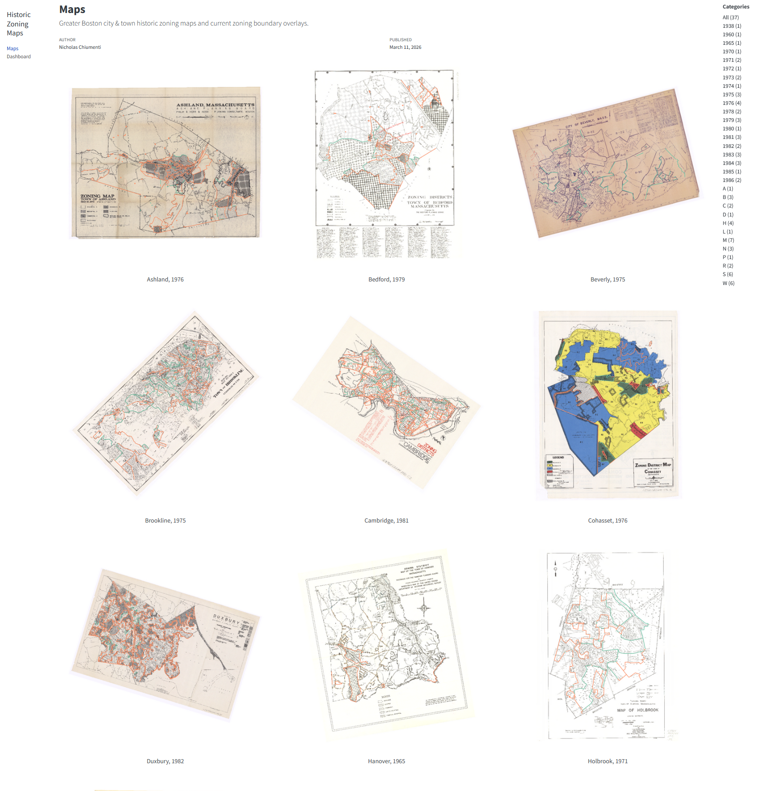

This website and accompanying GitHub repository contain the historic zoning maps 
and current boundary overlays found Appendix A.2 for *Under the (Neighbor)Hood: Understanding Interactions Among Zoning Regulations.*

[Link to the Historic Zoning Map website.](https://nchiumenti.github.io/historic-zoning-map)

{width="75%"}