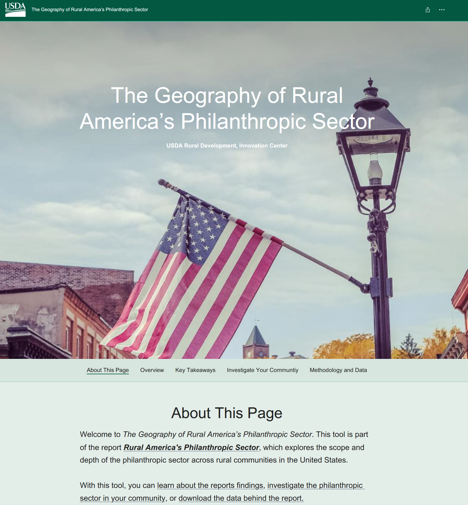

Philanthropic organizations are a key source of leadership and support in many 
communities across the United States, alongside partners in the private, public, 
and nonprofit sectors. Oftentimes, philanthropic organizations are able to 
contribute important resources to, and play critical roles in, the community 
that other stakeholders are less capable of handling. For example, philanthropies 
can often play the role of neutral conveners, bringing together leaders from 
across industries to discuss key issues affecting the community, and to achieve 
consensus on a path forward. 

[Link to the StoryMap The *Geography of Rural America’s Philanthropic Sector*.](https://storymaps.arcgis.com/stories/d498f6bbff054f26b1d94d556832bd27)

{width="75%"}